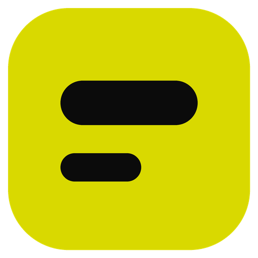
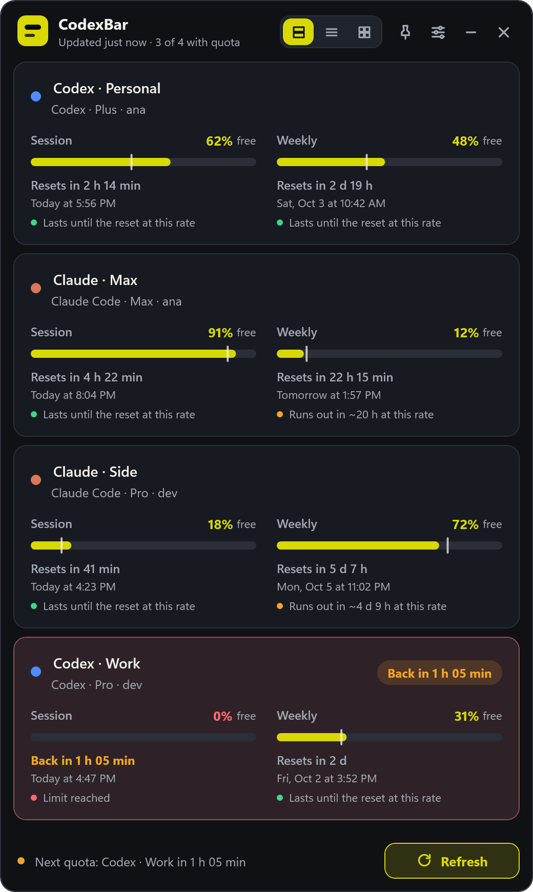
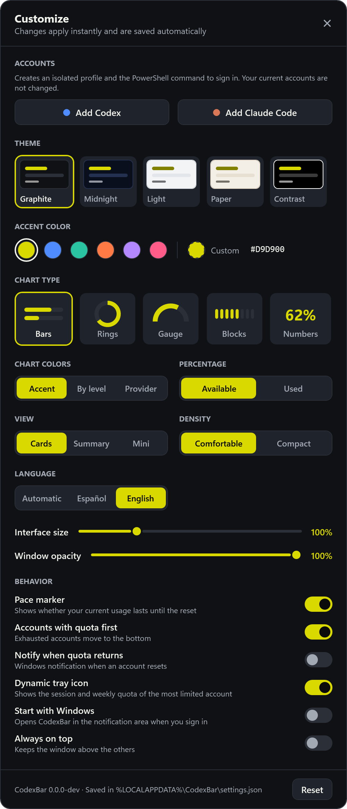
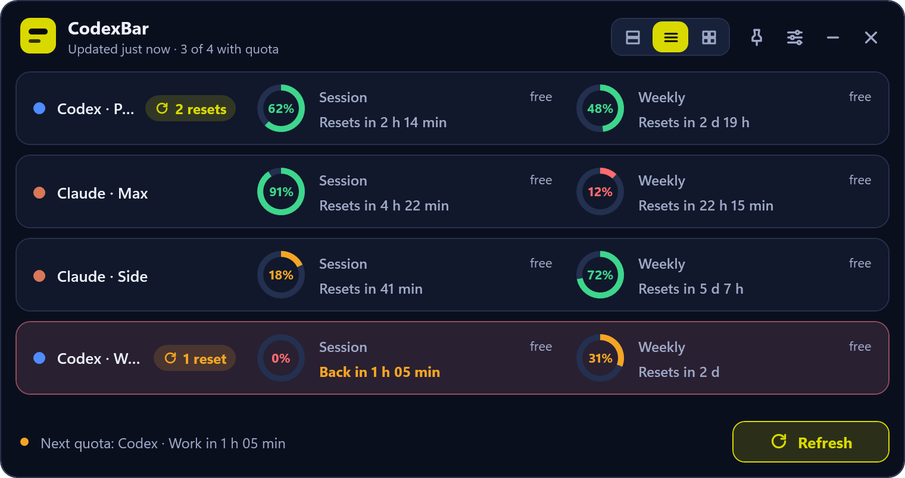
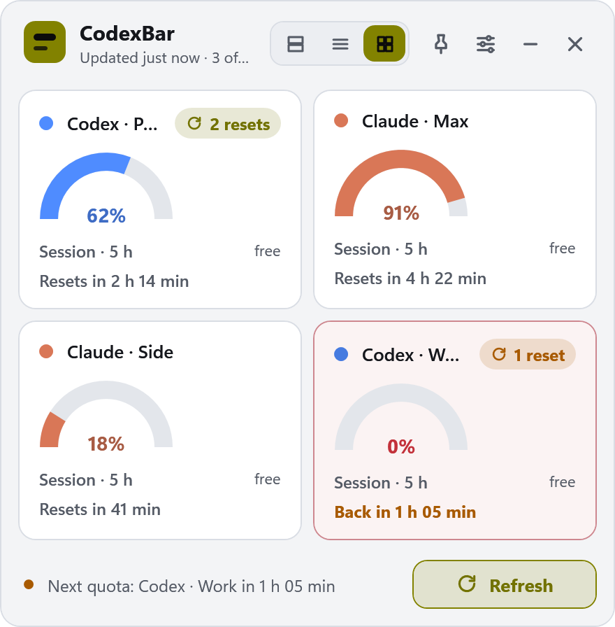

<p align="center">
  
</p>

<h1 align="center">CodexBar for Windows</h1>

<p align="center"><a href="README.md">Español</a> · <b>English</b></p>

> [!IMPORTANT]
> **This project is a fork of [steipete/CodexBar](https://github.com/steipete/CodexBar)**, created by
> [Peter Steinberger](https://github.com/steipete). The idea, the name, the provider architecture and
> much of the code (especially the Swift engine that queries usage limits) come from the original
> project. This fork adds a native **Windows 11** port with its own WPF tray app. If you use macOS or
> Linux, or need any of the 60+ providers CodexBar supports, use the
> [original repository](https://github.com/steipete/CodexBar).

Shows your **Codex** and **Claude Code** limits on the Windows desktop: how much is left in each usage
window, when it resets, and which account still has quota. Works with several accounts per provider.

[](https://github.com/reiterstahl/CodexBar-win/releases/latest)
[](#installation)
[](Windows/global.json)
[](https://github.com/steipete/CodexBar)
[](LICENSE)

<p align="center">
  
  &nbsp;
  
</p>
<p align="center">
  
</p>
<p align="center">
  
</p>
<p align="center"><sub>Cards and Customize (Graphite, bars) · Summary (Midnight, rings by level) · Mini (Light, gauge per provider). Fictitious accounts.</sub></p>

---

## Features

### Usage limits
- **Codex** (OpenAI) and **Claude Code** (Anthropic), using the session their official CLIs already have.
- **Session** (5-hour) and **Weekly** window for each account, with a progress bar and remaining
  percentage.
- **Live countdown** to the next reset, plus the full localized date.
- Model-specific weekly quotas that repeat the general quota are omitted.

### Multiple accounts
- Automatically discovers isolated `%USERPROFILE%\.codex-*` and `%USERPROFILE%\.claude-*` profiles
  in addition to the primary accounts.
- Each account is queried in its own short-lived process, so one failing account never affects the
  others.
- **Add accounts from the app**: in Customize → Accounts, one button per provider builds the sign-in
  command for a new profile.
- Click an account name to rename it.
- When an account loses its session, its card shows **Copy login**, which copies the PowerShell
  command to sign in to that specific profile. The command contains no credentials.
- Expired Claude Code tokens are refreshed automatically with the profile's refresh token.

### Quota status
- **Pace marker**: a line on the bar shows where you would be if you spread usage evenly until the
  reset, and a hint warns when the current rate would run out first (for example,
  *runs out in ~20 h at this rate*).
- When **Session** or **Weekly** hits 0%, the card turns red and moves below accounts that still have
  quota.
- An exhausted card shows **"Back in …"** in amber, turning green when the reset is 30
  minutes away or less.
- When quota returns, the card moves back up with **"Available again"** and
  flashes green until you click it. Optionally, Windows shows a notification.
- The window footer shows which account gets its quota back next.

### Customization
- **Themes**: Graphite, Midnight, Light, Paper, and high contrast.
- **Accent color**: six presets, any color from the picker, or a `#RRGGBB` code. If the chosen color
  is hard to read on the theme, it is adjusted automatically to keep enough contrast.
- **Chart type**: bars, rings, gauge, blocks, or large numbers.
- **Chart colors**: accent, by quota level (green, amber, red), or a custom color per provider.
- **Available** or **used** percentage, comfortable or compact density, and interface **scale** from
  80% to 160%, useful on 4K monitors.
- **Language**: Spanish or English, or automatic (follows the Windows display language).
- Everything applies instantly and is saved automatically.

### Window and tray
- Three views: **Cards** with full detail, **Summary** with one row per account, and **Mini**, a
  compact grid with each account's session.
- **Dynamic notification-area icon**: shows the session and weekly quota of the most limited account,
  with a red dot when one is exhausted or a green dot when one has just recovered.
- Large **Refresh** button at the bottom of the window, in every view.
- Tray menu with *Open*, *Refresh*, *Customize…*, and *Exit*.
- **Always on top**, minimize to the taskbar, and hide to the tray without closing the app.
- Drag the window by its header or any card; it remembers its position.
- Data refreshes every 5 minutes; the countdown advances every minute without querying providers again.

---

## Installation

### Requirements
- 64-bit Windows 11.
- [Codex CLI](https://learn.chatgpt.com/docs/codex) and/or [Claude Code](https://code.claude.com)
  installed and signed in.

### Installer (recommended)
1. Download **`CodexBarWindows-win-Setup.exe`** from the
   [latest release](https://github.com/reiterstahl/CodexBar-win/releases/latest).
2. Run it. It installs for your user, without administrator rights, creates shortcuts, and opens
   CodexBar.

- The installer bundles everything the app needs (.NET and Swift). If the Visual C++ runtime is
  missing, it downloads and installs it from Microsoft; only then does Windows ask for administrator
  permission.
- **Automatic updates**: CodexBar checks GitHub Releases at startup and every 6 hours. When a new
  version is available, it downloads it in the background and shows **Restart** in the
  window and the tray menu. If you don't restart, it installs the next time you open the app.
- To start with Windows, turn on **Start with Windows** in **Customize**.
- To uninstall, use *Settings → Apps → Installed apps → CodexBar*. Your preferences in
  `%LOCALAPPDATA%\CodexBar` and your Codex and Claude credentials are left untouched.

> The binaries are not signed yet, so SmartScreen may show *"Windows protected your PC"*. Choose
> **More info → Run anyway**.

### Portable ZIP
The same release page includes **`CodexBarWindows-win-Portable.zip`**: extract it and run
`CodexBar.Windows.Tray.exe`. It does not update automatically.

A step-by-step guide for a new PC (installing the CLIs and signing in to accounts) is available in
Spanish at [docs/windows-installation.es.md](docs/windows-installation.es.md).

### Adding secondary accounts

The easiest way: in **Customize → Accounts**, select **Add Codex** or **Add Claude Code**.
CodexBar picks the next free profile (`.codex-2`, `.codex-3`, …), copies the PowerShell sign-in command,
and offers **Open in PowerShell** to run it directly. When you finish, select **Refresh** and the new
account appears.

You can also create profiles with the script: download [`Add-CodexBarAccounts.ps1`](Windows/Add-CodexBarAccounts.ps1) (it is also included in the ZIP
built by `Publish-Windows.ps1`) and run it:

```powershell
powershell.exe -NoProfile -ExecutionPolicy Bypass -File .\Add-CodexBarAccounts.ps1 -Login
```

It creates `.codex-2` and `.claude-2` and starts the sign-in for each. Codex uses **device code** by
default: open the URL in the browser profile of the right account and enter the code. If that method
is not enabled, turn it on in your ChatGPT security settings. Other options:

- `-ProfileName work`: creates more profiles with another name.
- `-CodexBrowserLogin`: uses the flow that opens the browser.

Commands to check, sign out of, or redo each profile's session manually are in
[docs/windows-account-commands.es.md](docs/windows-account-commands.es.md) (Spanish).

---

## Security and privacy

- **CodexBar stores no credentials.** It reads the files the CLIs already manage
  (`.codex\auth.json`, `.claude\.credentials.json`) and never copies tokens into its own settings.
- `%LOCALAPPDATA%\CodexBar\settings.json` holds presentation preferences only: account names, view,
  theme, colors, chart type, scale, position, and behavior options.
- The tray app **never reads credential files**. It runs the engine as a child process with an
  argument list (no shell), a 45-second timeout, and a response size limit, and only accepts JSON with
  a known schema version.
- It never displays the engine's stderr or malformed output, so sensitive data cannot leak into the UI.

### Privacy policy

CodexBar has no telemetry or analytics and sends no data to servers of its own. It only connects to:

- `chatgpt.com`, to read Codex limits with the Codex CLI session.
- `api.anthropic.com` and `platform.claude.com`, to read Claude Code limits and refresh its token with
  the Claude Code session.
- `github.com`, to check for CodexBar updates (only in the version installed with Setup.exe).

Credentials are only sent to the provider that issued them. Nothing else leaves your PC.

---

## Architecture

```text
┌─────────────────────────────┐  child process per account  ┌──────────────────────────────┐
│ CodexBar.Windows.Tray (WPF) │ ──────────────────────────▶ │ CodexBarWindowsEngine (Swift)│
│ tray · window · settings    │ ◀───── versioned JSON ───── │ Codex / Claude Code OAuth    │
└─────────────────────────────┘                             └──────────────────────────────┘
            │ CodexBar.EngineClient: process execution, schema validation, profiles
```

| Component | Path | Role |
| --- | --- | --- |
| Portable engine | `Sources/CodexBarPortableCore`, `Sources/CodexBarWindowsEngine` | Foundation-only Swift; queries limits and prints the JSON snapshot |
| Engine client | `Windows/CodexBar.EngineClient` | Launches the engine, validates the schema, discovers profiles |
| Tray app | `Windows/CodexBar.Windows.Tray` | WPF on .NET 10; custom themes and charts (`Appearance/`, `UsageMeter`) and [Velopack](https://velopack.io) for install and updates |
| Demo engine | `Windows/Tools/CodexBar.DemoEngine` | Fictitious accounts for the README screenshots ([screenshots.yml](.github/workflows/screenshots.yml)) |
| Scripts | `Windows/*.ps1` | Package releases, publish, install the ZIP, update from source, add accounts |

This repository contains only the Windows port. The macOS app, the CLI, and the other providers live
in the [original project](https://github.com/steipete/CodexBar).

## Building from source

Requires the [Swift toolchain for Windows](https://www.swift.org/install/windows/) and the .NET 10 SDK.

```powershell
# Engine
swift build -c release --product CodexBarWindowsEngine
swift test --filter Portable

# Tray app and client tests
cd Windows
dotnet build .\CodexBar.Windows.Tray\CodexBar.Windows.Tray.csproj -c Release
dotnet run --project .\CodexBar.EngineClient.Tests\CodexBar.EngineClient.Tests.csproj -c Release
```

During development, place `CodexBarWindowsEngine.exe` next to `CodexBar.Windows.Tray.exe` or set
`CODEXBAR_ENGINE_PATH`.

### Publishing a release

Releases are built by GitHub Actions ([release-windows.yml](.github/workflows/release-windows.yml)).
Pushing a `windows-vX.Y.Z` tag builds the engine and the app, runs the tests, packages the installer
with [Velopack](https://velopack.io) (with deltas against the previous version), and publishes the
GitHub Release that installed copies update from:

```bash
git tag windows-v1.0.0
git push origin windows-v1.0.0
```

A tag with a suffix (`windows-v1.1.0-beta.1`) is published as a pre-release. To test packaging without
publishing, run the workflow manually (*Run workflow*) or, on Windows with `vpk` installed:

```powershell
dotnet tool install -g vpk --version 1.2.161
.\Windows\Package-Release.ps1 -Version 1.0.0
```

For day-to-day development, `Update-CodexBar.cmd` runs `git pull`, builds, and reinstalls the portable
version from the cloned repository.

Technical details (snapshot contract, process boundary, packaging) are in
[docs/windows.md](docs/windows.md).

## Roadmap

- Broader validation across Windows desktops.
- Windows Credential Manager support before CodexBar owns any secrets.
- Signed binaries and installer to avoid the SmartScreen warning.
- winget publishing.
- Parity tests against the mature macOS/Linux Codex and Claude mappings.

Out of scope for now: browser cookies, WebView2, ConPTY, and providers other than Codex and Claude Code.

---

## Credits and license

- Original project: **[CodexBar](https://github.com/steipete/CodexBar)** by
  [Peter Steinberger](https://github.com/steipete) ([codexbar.app](https://codexbar.app)).
- Windows port: [reiterstahl/CodexBar-win](https://github.com/reiterstahl/CodexBar-win).

Distributed under the [MIT license](LICENSE), which keeps the original author's copyright. Third-party
notices for the Windows package are in [Windows/THIRD-PARTY-NOTICES.md](Windows/THIRD-PARTY-NOTICES.md).
