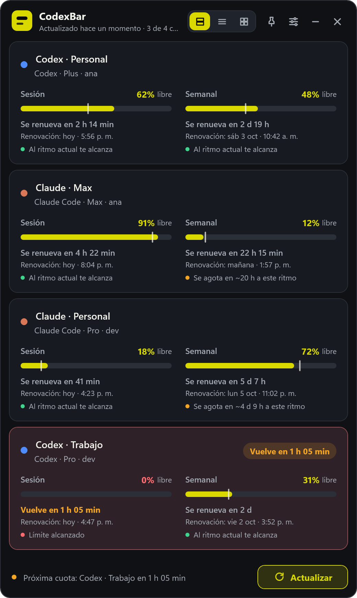
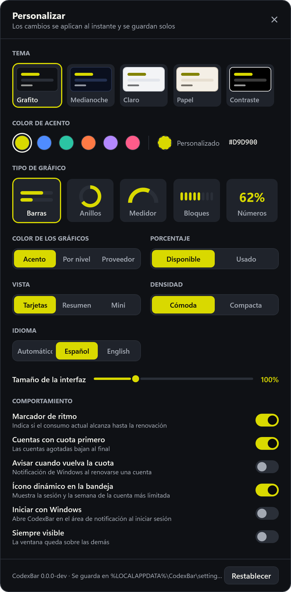
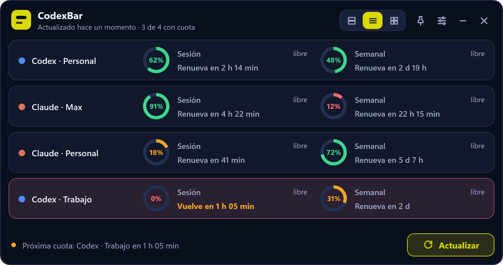
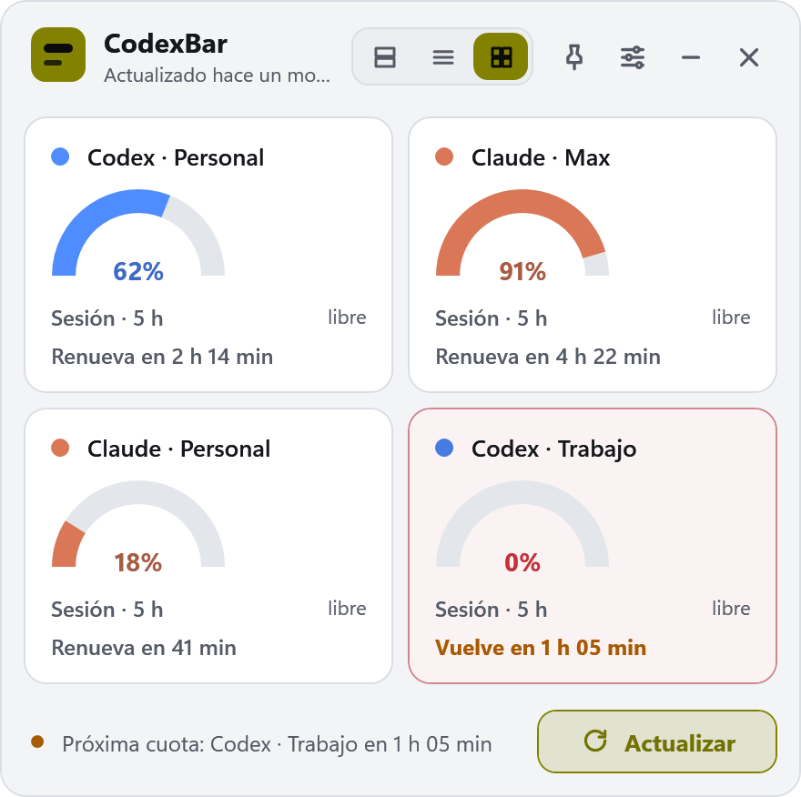

<p align="center">
  
</p>

<h1 align="center">CodexBar para Windows</h1>

<p align="center"><b>Español</b> · <a href="README.en.md">English</a></p>

> [!IMPORTANT]
> **Este proyecto es un fork de [steipete/CodexBar](https://github.com/steipete/CodexBar)**, creado por
> [Peter Steinberger](https://github.com/steipete). La idea, el nombre, la arquitectura de proveedores y
> gran parte del código (en especial el motor en Swift que consulta los límites de uso) vienen del
> proyecto original. Este fork agrega un port nativo para **Windows 11** con su propia aplicación de
> bandeja en WPF. Si usás macOS o Linux, o necesitás alguno de los más de 60 proveedores que soporta
> CodexBar, usá el [repositorio original](https://github.com/steipete/CodexBar).

Muestra en el escritorio de Windows los límites de **Codex** y **Claude Code**: cuánto te queda de
cada ventana de uso, cuándo se renueva y qué cuenta tiene cuota disponible. Funciona con varias
cuentas por proveedor.

[](https://github.com/reiterstahl/CodexBar-win/releases/latest)
[](#instalación)
[](Windows/global.json)
[](https://github.com/steipete/CodexBar)
[](LICENSE)

<p align="center">
  
  &nbsp;
  
</p>
<p align="center">
  
</p>
<p align="center">
  
</p>
<p align="center"><sub>Tarjetas y Personalizar (Grafito, barras) · Resumen (Medianoche, anillos por nivel) · Mini (Claro, medidor por proveedor). Cuentas ficticias.</sub></p>

---

## Qué hace

### Límites de uso
- **Codex** (OpenAI) y **Claude Code** (Anthropic), usando la sesión que ya tienen sus CLI oficiales.
- Ventana de **Sesión** (5 horas) y **Semanal** de cada cuenta, con barra de progreso y porcentaje
  disponible.
- **Cuenta regresiva en vivo** hasta la próxima renovación, más la fecha completa localizada
  (por ejemplo, *jueves 2 de octubre, 3:40 p. m.*).
- Se omiten las cuotas semanales por modelo que repiten la información de la cuota general.

### Varias cuentas
- Detecta automáticamente perfiles aislados `%USERPROFILE%\.codex-*` y `%USERPROFILE%\.claude-*`
  además de las cuentas principales.
- Cada cuenta se consulta en un proceso independiente y de corta duración, así que el fallo de una
  cuenta no afecta a las demás.
- Clic sobre el nombre de una cuenta para renombrarla.
- Si una cuenta perdió la sesión, su tarjeta muestra **Copiar login**, que copia el comando de
  PowerShell para autenticar ese perfil en particular. El comando no contiene credenciales.
- Los tokens vencidos de Claude Code se renuevan automáticamente con el refresh token del perfil.

### Estado de la cuota
- **Marcador de ritmo**: una línea sobre la barra indica dónde deberías estar si consumieras parejo
  hasta la renovación, y un aviso te dice si a este ritmo la cuota se agota antes (por ejemplo,
  *se agota en ~20 h a este ritmo*).
- Cuando **Sesión** o **Semanal** llega a 0 %, la tarjeta se marca en rojo y baja debajo de las cuentas
  que todavía tienen cuota.
- La tarjeta agotada muestra **"Vuelve en …"** en ámbar, que pasa a verde cuando faltan 30 minutos
  o menos para la renovación.
- Cuando la cuota vuelve, la tarjeta regresa arriba con **"Disponible otra vez"** y parpadea suavemente
  en verde hasta que hacés clic en ella. Opcionalmente, Windows muestra una notificación.
- El pie de la ventana indica cuál es la próxima cuenta que recupera cuota.

### Personalización
- **Temas**: Grafito, Medianoche, Claro, Papel y Alto contraste.
- **Color de acento**: seis predefinidos, cualquier color del selector o un código `#RRGGBB`. Si el
  color elegido no se lee bien sobre el tema, se ajusta automáticamente para mantener el contraste.
- **Tipo de gráfico**: barras, anillos, medidor, bloques o números grandes.
- **Color de los gráficos**: según el acento, por nivel de cuota (verde, ámbar o rojo) o un color
  elegible por proveedor.
- Porcentaje **disponible** o **usado**, densidad cómoda o compacta y **escala** del 80 % al 160 %,
  útil en monitores 4K.
- **Idioma**: español o inglés, o automático (según el idioma de Windows).
- Todo se aplica al instante y se guarda solo.

### Ventana y bandeja
- Tres vistas: **Tarjetas** con todo el detalle, **Resumen** con una fila por cuenta y **Mini**, una
  grilla compacta con la sesión de cada cuenta.
- **Ícono dinámico** en el área de notificación: muestra la sesión y la semana de la cuenta más
  limitada, con un punto rojo si hay una agotada o verde si una acaba de recuperarse.
- Botón **Actualizar** grande al pie de la ventana, en todas las vistas.
- Menú de la bandeja con *Abrir*, *Actualizar*, *Personalizar…* y *Salir*.
- **Siempre visible**, minimizar a la barra de tareas y ocultar a la bandeja sin cerrar la app.
- La ventana se arrastra desde el encabezado o desde cualquier tarjeta y recuerda su posición.
- Actualiza los datos cada 5 minutos; la cuenta regresiva avanza cada minuto sin volver a consultar
  a los proveedores.

---

## Instalación

### Requisitos
- Windows 11 de 64 bits.
- [Codex CLI](https://learn.chatgpt.com/docs/codex) y/o [Claude Code](https://code.claude.com)
  instalados y con sesión iniciada.

### Instalador (recomendado)
1. Descargá **`CodexBarWindows-win-Setup.exe`** desde la
   [última versión](https://github.com/reiterstahl/CodexBar-win/releases/latest).
2. Ejecutalo. Se instala para tu usuario, sin permisos de administrador, crea los accesos directos y
   abre CodexBar.

- El instalador incluye todo lo que la app necesita (.NET y Swift). Si falta el runtime de Visual C++,
  lo descarga e instala de Microsoft; solo en ese caso Windows pide permiso de administrador.
- **Actualizaciones automáticas**: CodexBar revisa GitHub Releases al iniciar y cada 6 horas. Cuando
  hay una versión nueva, la descarga en segundo plano y muestra **Reiniciar** en la ventana y en el
  menú de la bandeja. Si no reiniciás, se instala la próxima vez que abras la app.
- Para que arranque con Windows, activá **Iniciar con Windows** en **Personalizar**.
- Para desinstalar, usá *Configuración → Aplicaciones → Aplicaciones instaladas → CodexBar*. Tus
  preferencias en `%LOCALAPPDATA%\CodexBar` y las credenciales de Codex y Claude no se tocan.

> Los binarios todavía no están firmados, así que SmartScreen puede mostrar *"Windows protegió tu PC"*.
> Elegí **Más información → Ejecutar de todas formas**.

### ZIP portable
La misma página de la versión trae **`CodexBarWindows-win-Portable.zip`**: extraelo y ejecutá
`CodexBar.Windows.Tray.exe`. No se autoactualiza.

Hay una guía paso a paso, desde una PC nueva (instalación de los CLI y cuentas), en
[docs/windows-installation.es.md](docs/windows-installation.es.md).

### Agregar cuentas secundarias

Descargá [`Add-CodexBarAccounts.ps1`](Windows/Add-CodexBarAccounts.ps1) (también viene en el ZIP que genera
`Publish-Windows.ps1`) y ejecutalo:

```powershell
powershell.exe -NoProfile -ExecutionPolicy Bypass -File .\Add-CodexBarAccounts.ps1 -Login
```

Crea `.codex-2` y `.claude-2` y abre el login de cada uno. Codex usa **código de dispositivo** por
defecto: abrís la URL en el perfil de navegador de la cuenta correcta y pegás el código. Si ese
método no está habilitado, activalo en la configuración de seguridad de ChatGPT. Otras opciones:

- `-ProfileName trabajo`: crea más perfiles con otro nombre.
- `-CodexBrowserLogin`: usa el flujo que abre el navegador.

Los comandos para revisar, cerrar o rehacer la sesión de cada perfil a mano están en
[docs/windows-account-commands.es.md](docs/windows-account-commands.es.md).

---

## Seguridad y privacidad

- **CodexBar no guarda credenciales.** Lee los archivos que ya administran los CLI
  (`.codex\auth.json`, `.claude\.credentials.json`) y no copia tokens a su propia configuración.
- `%LOCALAPPDATA%\CodexBar\settings.json` solo contiene preferencias de presentación: nombres de las
  cuentas, vista, tema, colores, tipo de gráfico, escala, posición y opciones de comportamiento.
- La app de bandeja **no lee archivos de credenciales**. Ejecuta el motor como proceso hijo, con lista
  de argumentos (sin shell), un timeout de 45 s y un límite de respuesta. Solo acepta JSON con versión
  de esquema conocida.
- Nunca muestra stderr ni salidas malformadas del motor, para no exponer datos sensibles en la interfaz.

---

## Arquitectura

```text
┌─────────────────────────────┐   proceso hijo por cuenta   ┌──────────────────────────────┐
│ CodexBar.Windows.Tray (WPF) │ ──────────────────────────▶ │ CodexBarWindowsEngine (Swift)│
│ bandeja · ventana · ajustes │ ◀────── JSON versionado ─── │ OAuth Codex / Claude Code    │
└─────────────────────────────┘                             └──────────────────────────────┘
            │ CodexBar.EngineClient: ejecución, validación de esquema, perfiles
```

| Componente | Ruta | Rol |
| --- | --- | --- |
| Motor portable | `Sources/CodexBarPortableCore`, `Sources/CodexBarWindowsEngine` | Swift con Foundation únicamente; consulta los límites y emite el snapshot JSON |
| Cliente del motor | `Windows/CodexBar.EngineClient` | Lanza el motor, valida el esquema y descubre perfiles |
| App de bandeja | `Windows/CodexBar.Windows.Tray` | WPF sobre .NET 10; temas y gráficos propios (`Appearance/`, `UsageMeter`) y [Velopack](https://velopack.io) para instalar y actualizar |
| Engine de demo | `Windows/Tools/CodexBar.DemoEngine` | Cuentas ficticias para las capturas del README ([screenshots.yml](.github/workflows/screenshots.yml)) |
| Scripts | `Windows/*.ps1` | Empaquetar el release, publicar, instalar el ZIP, actualizar desde el código y agregar cuentas |

Este repositorio contiene solo el port de Windows. La app de macOS, el CLI y los demás proveedores
siguen en el [proyecto original](https://github.com/steipete/CodexBar).

## Compilar desde el código

Requiere el [toolchain de Swift para Windows](https://www.swift.org/install/windows/) y el .NET 10 SDK.

```powershell
# Motor
swift build -c release --product CodexBarWindowsEngine
swift test --filter Portable

# App de bandeja y tests del cliente
cd Windows
dotnet build .\CodexBar.Windows.Tray\CodexBar.Windows.Tray.csproj -c Release
dotnet run --project .\CodexBar.EngineClient.Tests\CodexBar.EngineClient.Tests.csproj -c Release
```

En desarrollo, poné `CodexBarWindowsEngine.exe` junto a `CodexBar.Windows.Tray.exe` o definí
`CODEXBAR_ENGINE_PATH`.

### Publicar una versión

Las versiones se construyen en GitHub Actions ([release-windows.yml](.github/workflows/release-windows.yml)).
Al pushear un tag `windows-vX.Y.Z`, el workflow compila el engine y la app, corre los tests, arma el
instalador con [Velopack](https://velopack.io) (con deltas contra la versión anterior) y publica el
GitHub Release del que se actualizan las copias instaladas:

```bash
git tag windows-v1.0.0
git push origin windows-v1.0.0
```

Un tag con sufijo (`windows-v1.1.0-beta.1`) se publica como pre-release. Para probar el empaquetado
sin publicar, ejecutá el workflow a mano (*Run workflow*) o, en Windows con `vpk` instalado:

```powershell
dotnet tool install -g vpk --version 1.2.161
.\Windows\Package-Release.ps1 -Version 1.0.0
```

Para desarrollo diario, `Update-CodexBar.cmd` hace `git pull`, compila y reinstala la versión
portable desde el repositorio clonado.

Los detalles técnicos (contrato del snapshot, límites del proceso, empaquetado) están en
[docs/windows.md](docs/windows.md).

## Pendiente

- Validación más amplia en distintos escritorios Windows.
- Soporte de Windows Credential Manager antes de que CodexBar administre secretos propios.
- Firma de binarios e instalador para evitar la advertencia de SmartScreen.
- Publicación en winget.
- Tests de paridad con los mapeos maduros de Codex y Claude de macOS/Linux.

Fuera de alcance por ahora: cookies de navegador, WebView2, ConPTY y proveedores distintos de Codex y
Claude Code.

---

## Créditos y licencia

- Proyecto original: **[CodexBar](https://github.com/steipete/CodexBar)** de
  [Peter Steinberger](https://github.com/steipete) ([codexbar.app](https://codexbar.app)).
- Port de Windows: [reiterstahl/CodexBar-win](https://github.com/reiterstahl/CodexBar-win).

Distribuido bajo la [licencia MIT](LICENSE), que conserva el copyright del autor original. Los avisos de
terceros del paquete de Windows están en [Windows/THIRD-PARTY-NOTICES.md](Windows/THIRD-PARTY-NOTICES.md).
